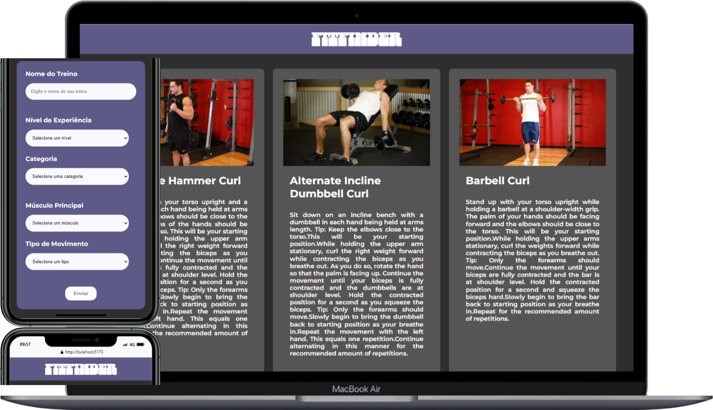

# **FitFinder**

FitFinder é uma aplicação web projetada para facilitar a busca por exercícios físicos. Através da integração com uma API de exercícios, ela oferece uma lista personalizada de atividades com base nos filtros selecionados pelo usuário, garantindo uma experiência de pesquisa eficiente e direcionada às suas necessidades.


## Índice
1. [Visão Geral](#visão-geral)
2. [Tecnologias](#tecnologias)
3. [Instalação](#instalação)
4. [Uso](#uso)
5. [Scripts Disponíveis](#scripts-disponíveis)
6. [Estrutura de Pastas](#estrutura-de-pastas)
7. [Contribuição](#contribuição)
8. [Licença](#licença)

---

## Visão Geral
Descreva brevemente o que o projeto faz, o problema que resolve, ou o propósito para o qual foi criado. Inclua capturas de tela ou gifs se possível para uma apresentação visual.

### Exemplo:
> Este é um projeto de To-Do List em React que permite aos usuários adicionar, editar e remover tarefas. O projeto tem como foco a prática de hooks, estados e eventos em React.

---

## Tecnologias
Liste as principais tecnologias e bibliotecas que o projeto utiliza.

### Exemplo:
- **React** - Biblioteca JavaScript para construir interfaces de usuário
- **Axios** - Para fazer requisições HTTP
- **Sass** - Para estilização
- **Figma** - Para elaboração do Design

---

## Instalação
Passos para instalar o projeto localmente. Seja específico, incluindo comandos.

### Exemplo:
1. Clone este repositório:
   ```bash
   git clone https://github.com/seu-usuario/nome-do-repositorio.git
